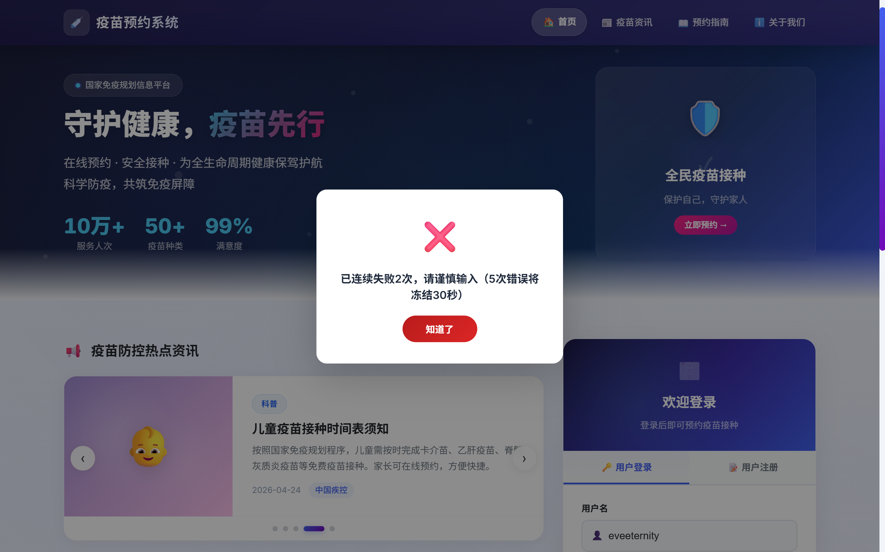
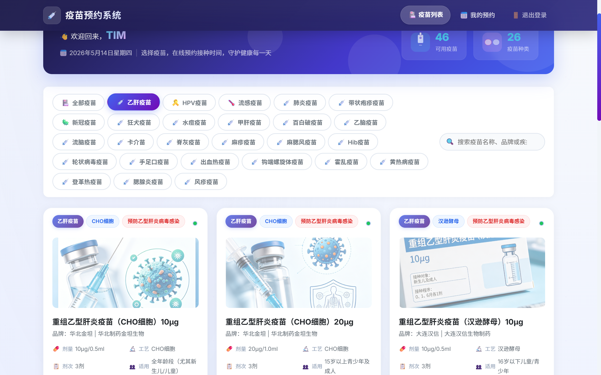
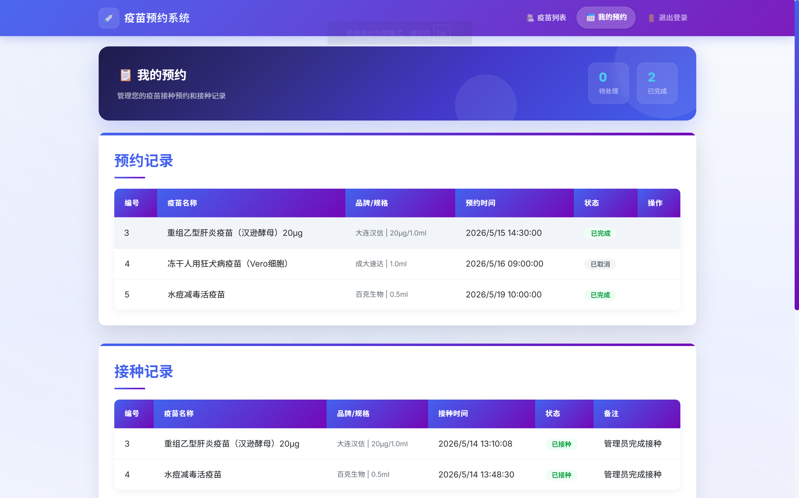
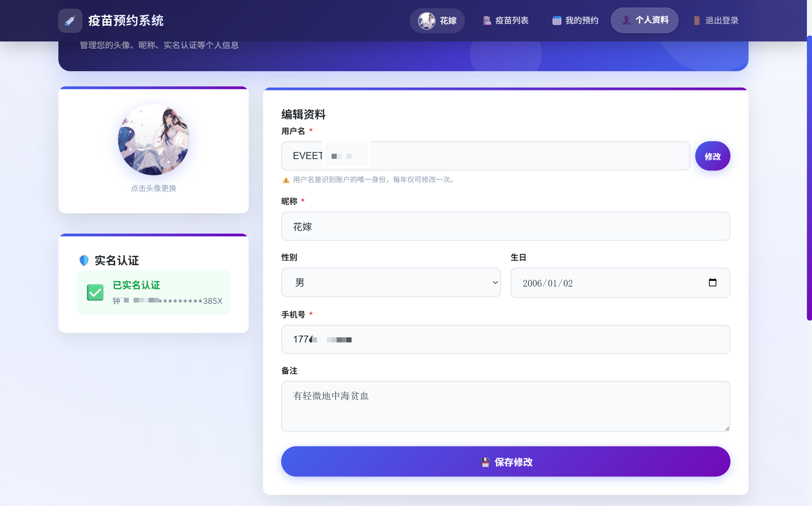
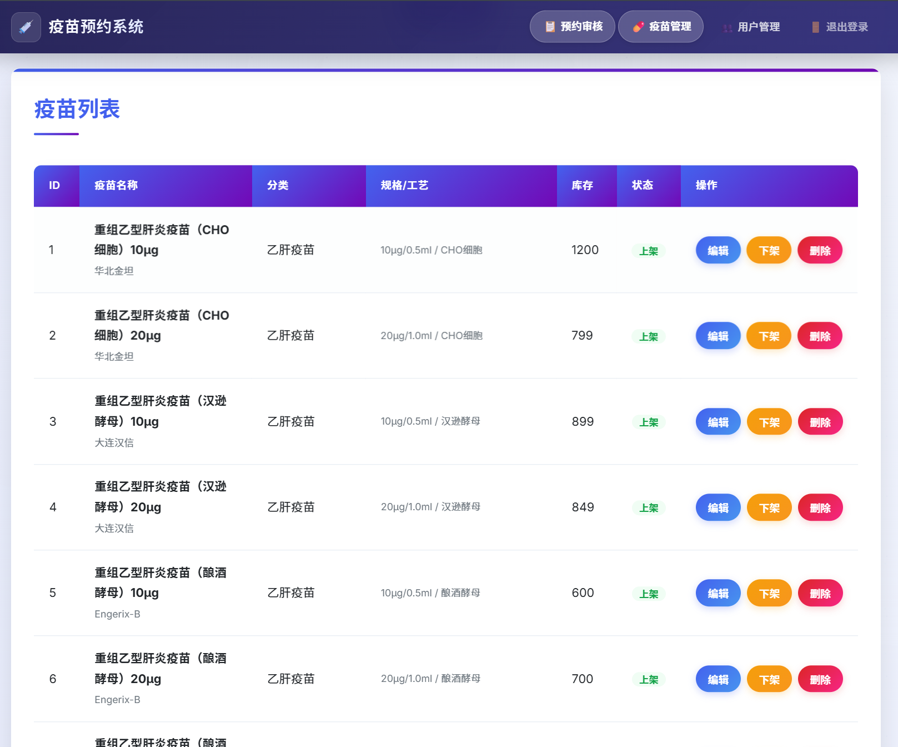
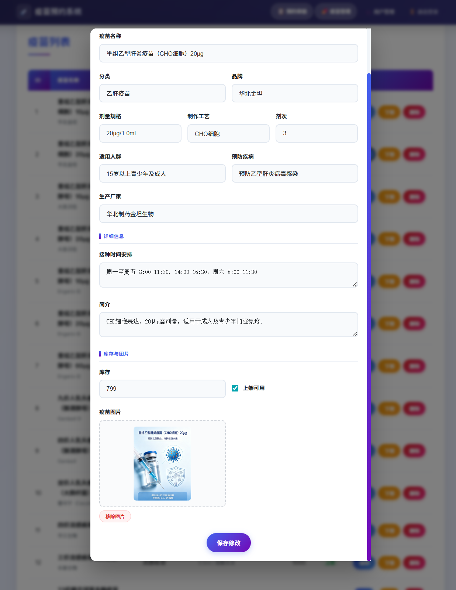
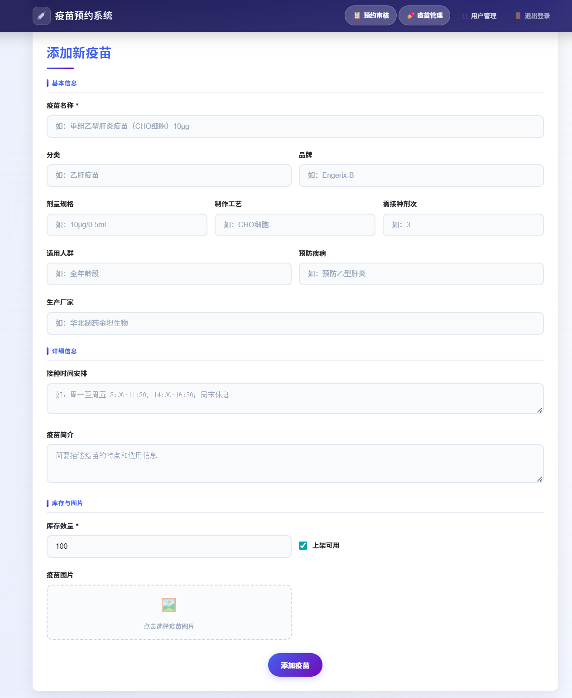
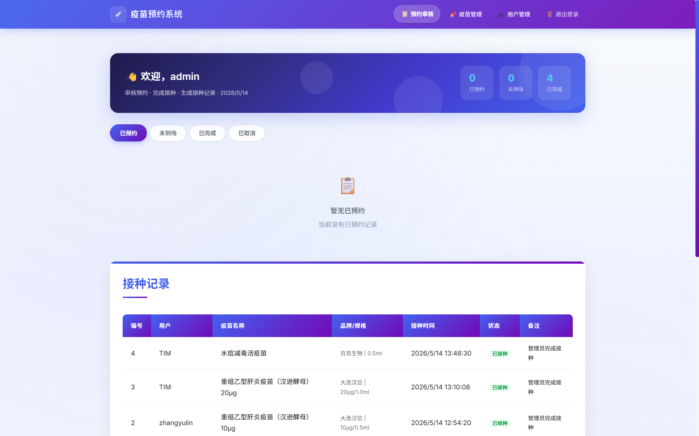
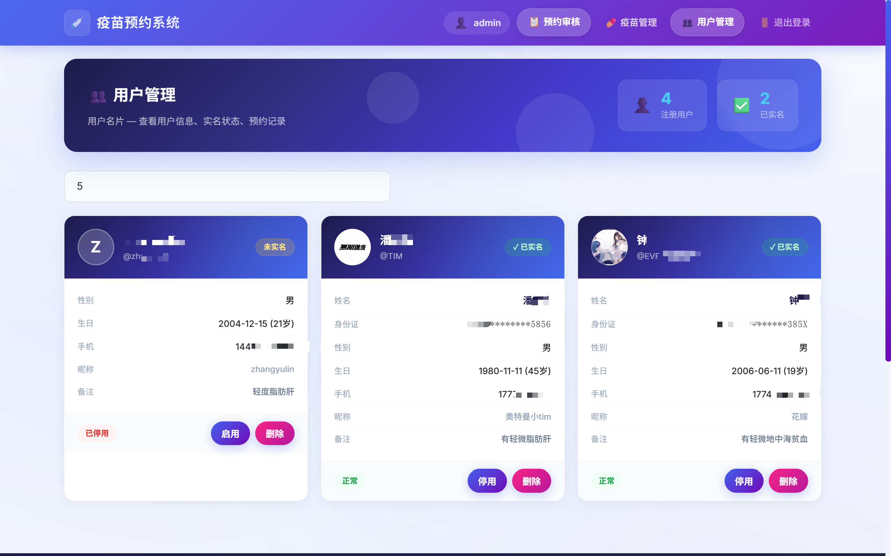

<h1 align="center">疫苗预约系统 | Vaccine Appointment System</h1>

> 基于 Vue 3 + Spring Boot 3 构建的前后端分离全栈疫苗预约管理平台，集成 Spring Security、JWT、Redis、MySQL、Docker 与 GitHub Actions，支持在线预约、后台审核、库存管理及自动化部署。


<br/>

<!-- 语言切换按钮 -->
<p align="center">
  <a href="README.md">
    
  </a>

  <a href="README_EN.md">
    
  </a>
</p>

<br/>

<!-- 技术栈标签 -->
<p align="center">
  
  
  
  
  
  
</p>


---

## 技术栈

| 层级            | 技术                                 | 版本          |
| --------------- | ------------------------------------ | ------------- |
| 后端框架        | Spring Boot                          | 3.1.5         |
| 前端框架        | Vue 3 (Composition API + TypeScript) | 3.4           |
| 安全认证        | Spring Security + JWT (JJWT)         | 0.12.5        |
| ORM             | Spring Data JPA / Hibernate          | —             |
| 数据库          | MySQL                                | 8.0+          |
| 缓存 / 分布式锁 | Redis                                | 7+ (降级可用) |
| 接口文档        | SpringDoc OpenAPI                    | 2.2           |
| 构建工具        | Vite                                 | 5.x           |
| 状态管理        | Pinia                                | 2.x           |
| 路由            | Vue Router                           | 4.x           |
| HTTP 客户端     | Axios                                | 1.x           |
| 项目构建        | Maven                                | 3.9+          |
| 部署            | Docker & Docker Compose              | —             |

---

## 功能特性

### 用户端

| 功能        | 说明                                                                                              |
| ----------- | ------------------------------------------------------------------------------------------------- |
| 注册 / 登录 | JWT 令牌认证，防暴力破解（5 次失败触发逐级冻结），登录后自动同步完整用户资料                      |
| 疫苗浏览    | 按分类筛选、关键词搜索，46 种疫苗含品牌、剂量、工艺等详情                                         |
| 疫苗详情    | 品牌、制造商、剂次、接种途径、年龄范围、目标疾病、免疫程序                                        |
| 在线预约    | 选择日期 + 时段，自动区分工作日 / 周六半天 / 周日休息，需先完成实名认证                           |
| 我的预约    | 查看 / 取消预约 / 在线支付，状态流转：已预约 → 已完成 / 未到场 / 已取消，支付与状态区域加宽更醒目 |
| 接种记录    | 查看个人历史接种记录                                                                              |
| 个人设置    | 头像上传与预览、昵称修改、性别 / 生日 / 手机号编辑、备注                                          |
| 实名认证    | 身份证号自动派生性别，格式校验，认证后解锁预约功能                                                |
| 用户名修改  | 每年仅可修改一次，显示下次可修改日期，用户名是账户唯一身份标识                                    |
| 手机号校验  | 11 位数字，1 开头第二位 3-9，前后端双重校验                                                       |
| 弹窗反馈    | 全局弹窗提示（成功 / 失败），3 秒自动消失，替代内联提醒更醒目                                     |

### 管理端

| 功能       | 说明                                                                              |
| ---------- | --------------------------------------------------------------------------------- |
| 预约审核   | 按状态筛选（已预约 / 已完成 / 未到场 / 已取消），支持完成接种、补录接种、取消预约 |
| 疫苗管理   | 上架 / 下架、添加、编辑、删除、库存调整、图片上传                                 |
| 用户管理   | 用户列表、启用 / 停用、删除、查看实名认证信息                                     |
| 管理员管理 | 管理员账号的增删改查                                                              |
| 接种记录   | 查看所有用户的接种记录，执行接种操作                                              |
| 数据概览   | 各状态预约数量实时统计                                                            |

### 基础设施

| 特性            | 说明                                               |
| --------------- | -------------------------------------------------- |
| JWT 无状态认证  | 每次请求携带 `Authorization: Bearer <token>`       |
| BCrypt 密码加密 | 所有密码 BCrypt 哈希存储                           |
| 防暴力破解      | 登录失败 5 次触发逐级冻结 30s → 60s                |
| Redis 分布式锁  | 预约操作防并发超卖，Redis 不可用时自动降级为本地锁 |
| 乐观锁          | Vaccine 库存使用 @Version 防并发超卖               |
| CORS 跨域防护   | 仅允许配置的源                                     |
| 角色权限        | ROLE_USER / ROLE_ADMIN 二级隔离                    |

---

## 快速开始

### 环境要求

- **Docker & Docker Compose** (推荐，一键部署)
- 或手动安装：**JDK 17+** + **MySQL 8.0+** + **Node.js 18+** + **Redis 7+** (可选)

### 方式一：Docker 一键部署 (推荐)

```bash
# Linux / macOS
bash start.sh

# Windows
start.bat
```

脚本会自动：

1. 检查 `.env` 环境变量文件（首次运行从 `.env.example` 复制）
2. 检测 Docker 环境
3. 构建镜像并启动所有服务
4. 等待 MySQL → Redis → Backend 健康检查通过
5. 打印访问地址

启动 4 个容器：

| 容器               | 服务              | 端口 |
| ------------------ | ----------------- | ---- |
| `vaccine-mysql`    | MySQL 8.0         | 3306 |
| `vaccine-redis`    | Redis 7           | 6379 |
| `vaccine-backend`  | Spring Boot 应用  | 8080 |
| `vaccine-frontend` | Nginx + Vue 3 SPA | 80   |

数据库首次启动自动执行 `database/init.sql`，创建 5 张表并初始化 46 种疫苗 + 1 个管理员账号。

### 方式二：开发模式（前后端分离）

```bash
# 终端 1：启动后端
mvn spring-boot:run -Dspring-boot.run.profiles=dev

# 终端 2：启动前端 (热重载)
cd frontend && npm install && npm run dev
```

| 服务                   | 地址                                  |
| ---------------------- | ------------------------------------- |
| 前端 (Vite Dev Server) | http://localhost:5173                 |
| 后端 API               | http://localhost:8080                 |
| Swagger UI             | http://localhost:8080/swagger-ui.html |

Vite 开发服务器自动将 `/api` 和 `/uploads` 请求代理到后端 `localhost:8080`。

### 方式三：单体 JAR 部署

```bash
# 构建前端并打包为单体 JAR
mvn package -Pfrontend -DskipTests

# 运行
java -jar target/vaccine-appointment-system-0.0.1-SNAPSHOT.jar
```

访问 `http://localhost:8080`，前后端均由 Spring Boot 提供服务。

---

### 默认管理员账号（初始化机制）

系统启动时通过 DataInitializer 自动创建管理员账号（仅当数据库无管理员数据时执行）：

- 默认角色：ROLE_ADMIN
- 账号来源：系统初始化脚本 / DataInitializer
- 密码策略：BCrypt 加密存储（生产环境建议通过环境变量覆盖）

普通用户可通过注册接口自行创建账号。

---

## 配置说明

### 环境变量

所有敏感配置通过环境变量注入，详见 `.env.example`：

```bash
# MySQL
MYSQL_ROOT_PASSWORD=root
MYSQL_DATABASE=vaccine_appointment_db
MYSQL_USER=vaccine_user
MYSQL_PASSWORD=vaccine_pass

# Redis (留空则无密码)
REDIS_PASSWORD=

# JWT (生产环境务必更换)
JWT_SECRET=change-me-to-a-random-64-character-string-in-production

# 端口
APP_PORT=8080
FRONTEND_PORT=80
```

### Spring Profile

| Profile      | 说明                                              |
| ------------ | ------------------------------------------------- |
| `dev` (默认) | 开发环境，SQL 日志 + DEBUG 级别                   |
| `prod`       | 生产环境，启用 Redis 缓存 + Gzip 压缩 + WARN 日志 |

---

## API 接口概览

### 公开接口

| Method | Path                  | 说明                                               |
| ------ | --------------------- | -------------------------------------------------- |
| POST   | `/api/auth/login`     | 统一登录，返回完整用户资料（含头像、实名、手机等） |
| GET    | `/api/auth/verify`    | 验证 Token 并同步完整用户资料                      |
| POST   | `/api/users/register` | 用户注册                                           |

### 用户接口

| Method | Path                         | 说明                           |
| ------ | ---------------------------- | ------------------------------ |
| GET    | `/api/users/{id}`            | 获取用户信息（含完整资料）     |
| GET    | `/api/users/username/{name}` | 按用户名查询                   |
| PUT    | `/api/users/{id}/profile`    | 更新个人资料（含手机号校验）   |
| PUT    | `/api/users/{id}/username`   | 修改用户名（每年一次）         |
| POST   | `/api/users/{id}/avatar`     | 上传头像                       |
| POST   | `/api/users/{id}/verify`     | 实名认证（身份证自动派生性别） |

### 疫苗接口

| Method | Path                         | 说明                       |
| ------ | ---------------------------- | -------------------------- |
| GET    | `/api/vaccines`              | 疫苗列表                   |
| GET    | `/api/vaccines/available`    | 可用疫苗（已上架且有库存） |
| GET    | `/api/vaccines/search?name=` | 搜索疫苗                   |
| GET    | `/api/vaccines/{id}`         | 疫苗详情                   |

### 预约接口

| Method | Path                              | 说明         |
| ------ | --------------------------------- | ------------ |
| POST   | `/api/appointments`               | 创建预约     |
| GET    | `/api/appointments/user/{userId}` | 用户预约列表 |
| GET    | `/api/appointments/{id}`          | 预约详情     |
| POST   | `/api/appointments/{id}/cancel`   | 取消预约     |
| POST   | `/api/appointments/{id}/pay`      | 支付         |

### 接种记录接口

| Method | Path                                       | 说明           |
| ------ | ------------------------------------------ | -------------- |
| GET    | `/api/vaccination-records/user/{userId}`   | 用户接种记录   |
| GET    | `/api/vaccination-records/status/{status}` | 按状态查询记录 |

### 管理员接口 (ROLE_ADMIN)

#### 用户管理

| Method | Path              | 说明                |
| ------ | ----------------- | ------------------- |
| GET    | `/api/users`      | 用户列表            |
| PUT    | `/api/users/{id}` | 更新用户 (状态切换) |
| DELETE | `/api/users/{id}` | 删除用户            |

#### 管理员账号管理

| Method | Path               | 说明       |
| ------ | ------------------ | ---------- |
| GET    | `/api/admins`      | 管理员列表 |
| GET    | `/api/admins/{id}` | 管理员详情 |
| POST   | `/api/admins`      | 创建管理员 |
| PUT    | `/api/admins/{id}` | 更新管理员 |
| DELETE | `/api/admins/{id}` | 删除管理员 |

#### 疫苗管理

| Method | Path                              | 说明         |
| ------ | --------------------------------- | ------------ |
| POST   | `/api/vaccines`                   | 添加疫苗     |
| PUT    | `/api/vaccines/{id}`              | 更新疫苗     |
| DELETE | `/api/vaccines/{id}`              | 删除疫苗     |
| PATCH  | `/api/vaccines/{id}/availability` | 上架 / 下架  |
| PATCH  | `/api/vaccines/{id}/stock`        | 调整库存     |
| POST   | `/api/vaccines/{id}/upload-image` | 上传疫苗图片 |

#### 预约管理

| Method | Path                                  | 说明           |
| ------ | ------------------------------------- | -------------- |
| GET    | `/api/appointments`                   | 全部预约       |
| GET    | `/api/appointments/pending`           | 待处理预约     |
| GET    | `/api/appointments/status/{status}`   | 按状态查询预约 |
| GET    | `/api/appointments/{id}/logs`         | 预约操作日志   |
| POST   | `/api/appointments/{id}/complete`     | 完成接种       |
| POST   | `/api/appointments/{id}/late-record`  | 补录接种       |
| POST   | `/api/appointments/{id}/cancel/admin` | 管理员取消预约 |

#### 接种记录管理

| Method | Path                                           | 说明           |
| ------ | ---------------------------------------------- | -------------- |
| GET    | `/api/vaccination-records/{id}`                | 记录详情       |
| GET    | `/api/vaccination-records/vaccine/{vaccineId}` | 按疫苗查询记录 |
| PUT    | `/api/vaccination-records/{id}`                | 更新接种记录   |
| POST   | `/api/vaccination-records/{id}/administer`     | 执行接种       |

#### 统计

| Method | Path              | 说明     |
| ------ | ----------------- | -------- |
| GET    | `/api/statistics` | 数据概览 |

---

## 项目结构

```
vaccine-appointment-system/
├── frontend/                          # Vue 3 前端工程
│   ├── src/
│   │   ├── views/                     # 页面视图
│   │   │   ├── HomeView.vue           #   首页（登录 / 注册 / 轮播）
│   │   │   ├── UserDashboardView.vue  #   疫苗浏览与预约
│   │   │   ├── UserProfileView.vue    #   我的预约与接种记录
│   │   │   ├── UserSettingsView.vue   #   个人设置（资料 / 头像 / 实名认证）
│   │   │   ├── AdminDashboardView.vue #   预约管理控制台
│   │   │   ├── AdminVaccineView.vue   #   疫苗 CRUD 管理
│   │   │   └── AdminUsersView.vue     #   用户管理
│   │   ├── components/                # 可复用组件
│   │   │   ├── SiteHeader.vue         #   全局导航栏
│   │   │   ├── SiteFooter.vue         #   页脚
│   │   │   ├── ModalMessage.vue       #   全局弹窗提示（成功/失败）
│   │   │   ├── LoadingOverlay.vue     #   加载遮罩
│   │   │   ├── NewsCarousel.vue       #   疫苗资讯轮播
│   │   │   ├── MedicalIllustration.vue#   医学插画装饰
│   │   │   ├── LoginMessage.vue       #   登录防暴力破解提示
│   │   │   ├── VaccineCard.vue        #   疫苗卡片
│   │   │   ├── AppointmentModal.vue   #   预约日期时段选择
│   │   │   └── VaccineEditModal.vue   #   疫苗编辑表单
│   │   ├── router/index.ts            # 路由配置 + 导航守卫
│   │   ├── stores/auth.ts             # Pinia 认证状态管理
│   │   ├── services/api.ts            # Axios 请求封装
│   │   └── styles/global.css          # 全局样式
│   ├── vite.config.ts                 # Vite 配置
│   ├── tsconfig.json
│   └── package.json
├── src/main/
│   ├── java/com/springboot/vaccineappointmentsystem/
│   │   ├── config/                    # SecurityConfig, JwtTokenProvider, RedisConfig, DataInitializer ...
│   │   ├── controller/                # AuthController, VaccineController, AppointmentController, AdminController ...
│   │   ├── service/                   # 业务接口 + impl 实现
│   │   ├── repository/                # JPA 数据访问层
│   │   ├── entity/                    # SysUser, Vaccine, Appointment, VaccinationRecord, AppointmentLog
│   │   ├── enums/                     # AppointmentStatus, VaccinationRecordStatus 枚举及 JPA 转换器
│   │   ├── dto/                       # ApiResponse 统一响应体, AppointmentStatistics
│   │   └── exception/                 # GlobalExceptionHandler 全局异常处理
│   └── resources/
│       ├── application.yml            # 主配置
│       ├── application-dev.yml        # 开发环境配置
│       ├── application-prod.yml       # 生产环境配置
│       └── static/                    # Vite 构建输出 (开发模式不使用，已 .gitignore)
├── database/
│   └── init.sql                       # 数据库初始化脚本 (DDL + 46 疫苗 + 1 管理员)
├── docker/
│   ├── Dockerfile.backend             # Spring Boot 多阶段构建
│   ├── Dockerfile.frontend            # Vue 3 + Nginx 多阶段构建
│   ├── mysql/
│   │   └── init.sql                   # MySQL 容器初始化脚本
│   └── nginx/
│       └── nginx.conf                 # Nginx 反向代理 + SPA 配置
├── .github/workflows/
│   └── ci-cd.yml                      # CI/CD 流水线
├── docker-compose.yml                 # Docker 一键编排
├── start.sh                           # Linux / macOS 一键启动脚本
├── start.bat                          # Windows 一键启动脚本
├── .env.example                       # 环境变量模板
└── pom.xml                            # Maven 配置 (含 frontend profile)
```

---

## 数据库

5 张表由 Hibernate `ddl-auto: update` 自动维护，Docker 部署时由 `database/init.sql` 初始化。

| 表名                 | 说明                                                                                 |
| -------------------- | ------------------------------------------------------------------------------------ |
| `sys_user`           | 用户表（含管理员，通过 role 区分），支持头像、实名认证、用户名修改冷却               |
| `vaccine`            | 疫苗库存与元数据，@Version 乐观锁防并发超卖                                          |
| `appointment`        | 预约记录 (0=已预约, 1=已完成, 2=未到场, 3=已取消)，支持在线支付 (0=未支付, 1=已支付) |
| `vaccination_record` | 接种记录，关联预约、用户、疫苗、医生                                                 |
| `appointment_log`    | 预约操作审计日志                                                                     |

### 疫苗种子数据（46 种）

| 分类     | 数量 | 示例                                                                                                                                                    |
| -------- | ---- | ------------------------------------------------------------------------------------------------------------------------------------------------------- |
| 乙肝疫苗 | 7    | 重组乙型肝炎 (CHO/汉逊酵母/酿酒酵母)，10μg/20μg/60μg                                                                                                    |
| HPV 疫苗 | 3    | 九价 Gardasil 9、四价 Gardasil、二价 馨可宁                                                                                                             |
| 流感疫苗 | 3    | 四价流感 (裂解)、三价流感 (裂解/亚单位)                                                                                                                 |
| 肺炎疫苗 | 3    | 23 价多糖、13 价结合                                                                                                                                    |
| 其他     | 30   | 带状疱疹、新冠、狂犬、水痘、甲肝、百白破、乙脑、流脑、卡介苗、脊灰、麻腮风、Hib、轮状病毒、EV71、出血热、钩端螺旋体、霍乱、黄热病、登革热、腮腺炎、风疹 |

> 疫苗图片默认使用占位图，需通过管理后台上传真实图片。

---

## CI/CD

项目包含 GitHub Actions 流水线 (`.github/workflows/ci-cd.yml`)：

| Job                    | 说明                         |
| ---------------------- | ---------------------------- |
| Fast Check             | Maven 编译，快速失败         |
| Secret Scan            | Gitleaks 密钥扫描            |
| OWASP Dependency Check | 依赖安全漏洞检查             |
| CodeQL Analysis        | 代码安全分析                 |
| Build & Test           | Maven 测试 + 打包 + 上传制品 |
| Docker Build           | Docker 镜像构建验证          |

---

## Docker 部署架构

```
                   ┌──────────────────┐
                   │   Nginx (:80)    │
                   │  Vue 3 SPA +     │
                   │  API 反向代理     │
                   └────────┬─────────┘
                            │ /api/* → backend:8080
                   ┌────────▼─────────┐
                   │  Spring Boot     │
                   │  (:8080)         │
                   └──┬──────────┬────┘
                      │          │
              ┌───────▼──┐  ┌───▼──────┐
              │  MySQL   │  │  Redis   │
              │  (:3306) │  │  (:6379) │
              └──────────┘  └──────────┘
```

## 项目截图

---

## 首页


---

## 密码防暴力破解

## 

## 用户端

### 用户查看疫苗列表



---

### 用户预约疫苗页面



### 用户修改个人资料



---

## 管理员端

### 疫苗管理列表



---

### 疫苗编辑



---

### 疫苗管理模块



---

### 预约审核列表



---

### 管理员管理用户



## License

MIT

---

## 作者

[https://github.com/AbsoluteZero001](https://github.com/AbsoluteZero001)

本项目为 Spring Boot + Vue 3 全栈学习实践项目，不涉及任何真实业务数据，所有数据均为模拟测试数据。欢迎 Fork 与学习交流。

(c) 2026 All Rights Reserved.
